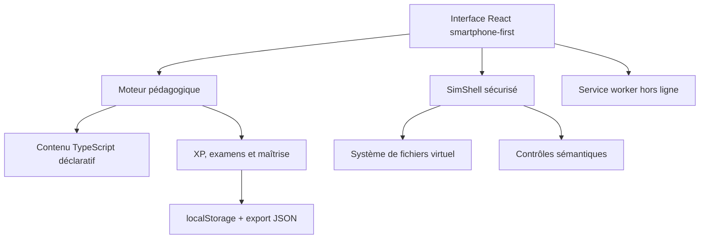

# CR3@TIX Learn Linux

Application progressive et interactive pour apprendre Linux de zéro jusqu'à des situations proches du monde professionnel. L'expérience associe des explications accessibles, un terminal simulé sécurisé, des exercices vérifiés, des examens et un système de progression.

## Ce qui est déjà fonctionnel

- 5 niveaux : Découverte, Bases, Intermédiaire, Avancé et Expert / Pro
- 27 modules, plus de 50 leçons et 25 questions d'examen
- terminal Linux pédagogique utilisable au clavier et sur smartphone
- système de fichiers virtuel avec navigation, fichiers, permissions et redirections
- simulation de plus de 40 commandes, dont Bash, SSH, réseau, services, Git et Docker
- correction sémantique : l'objectif est vérifié dans l'état du laboratoire, pas seulement par comparaison de texte
- trois indices progressifs par exercice, avec ajustement de l'XP
- niveaux, XP, rangs, progression, badges, séries de jours et maîtrise par compétence
- bibliothèque de commandes, recherche, favoris et glossaire
- historique, statistiques, export/import de progression et certificat final
- thème clair/sombre, interface responsive, accessibilité clavier et réduction des animations
- PWA installable et fonctionnement hors connexion après la première visite
- aucune inscription et aucune dépendance à un service payant

## Sécurité du terminal

Le terminal est un interpréteur pédagogique écrit en TypeScript. Il ne lance aucune commande sur l'appareil, n'accède pas au vrai système de fichiers et n'ouvre aucune connexion réseau. Chaque commande agit uniquement sur un état virtuel conservé en mémoire.

Les commandes sensibles (`rm`, `kill`, `sudo`, `systemctl`, `ufw`, `docker`) sont simulées. Les cibles système essentielles du laboratoire sont aussi protégées contre la suppression.

## Architecture



| Zone | Fichiers principaux | Rôle |
|---|---|---|
| Interface | `src/learn-linux/LearnLinuxApp.tsx` | navigation, leçons, examens, profil |
| Terminal | `src/learn-linux/TerminalPanel.tsx` | saisie, historique, rendu et raccourcis mobiles |
| Simulateur | `src/learn-linux/sim-shell.ts` | commandes, shell, pipes, redirections et état virtuel |
| Programme | `src/learn-linux/content.ts` | niveaux, modules, leçons, quiz, commandes et glossaire |
| Progression | `src/learn-linux/progress.ts` | sauvegarde, déblocage, XP, rangs et badges |
| GitHub Pages | `github/`, `vite.github.config.ts` | entrée statique et compilation dédiée |
| PWA | `public/manifest.webmanifest`, `public/sw.js` | installation et cache hors connexion |

## Ajouter une leçon

Le contenu est déclaratif. Une leçon définit son explication, son exemple, ses indices et les conditions objectives de réussite :

```ts
lesson(
  "id-unique",
  "Titre",
  "Catégorie",
  "Explication simple.",
  ["Point clé 1", "Point clé 2"],
  "ls",
  "ls -la",
  "Affiche tous les fichiers avec leurs détails.",
  [{ type: "command", pattern: "^ls\\s+-la$", label: "ls -la est exécutée" }],
  ["Premier indice", "Indice plus précis", "Commande complète"],
  "Explication du résultat.",
  30,
);
```

Les contrôles disponibles couvrent la commande, la sortie, le dossier courant, les fichiers, leur contenu, les permissions, les variables, les paquets, les processus, les services, SSH et Docker. Les tests exécutent automatiquement chaque exemple de cours et confirment qu'il satisfait ses contrôles.

## Développement local

Prérequis : Node.js 22.13 ou plus récent.

```bash
npm ci
npm run dev
```

Commandes de contrôle :

```bash
npm run typecheck
npm run lint
npm run test:unit
npm run build:github
npm test
```

## Déploiement GitHub Pages

Le workflow `.github/workflows/deploy-pages.yml` reconstruit et publie automatiquement l'application à chaque push sur `main`. Le chemin public est configuré pour le dépôt `CR3-TIX-LEARN-LINUX-`.

## Limites assumées

- SimShell reproduit les comportements utiles aux exercices, mais ne remplace pas une distribution Linux complète.
- La progression est locale à l'appareil. L'export JSON permet de la transférer ; une synchronisation par compte pourra être ajoutée ultérieurement.
- Le premier chargement nécessite Internet. Le service worker rend ensuite l'application disponible hors connexion.
- SSH, réseau, systemd, Git et Docker sont des scénarios simulés. Une future version avancée pourra proposer des conteneurs distants temporaires et fortement isolés.

## Licence

MIT — voir [LICENSE](LICENSE).
