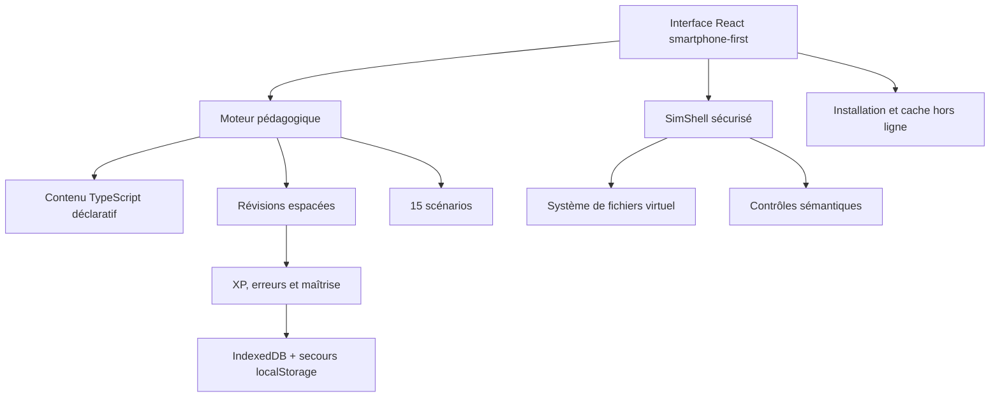

# CR3@TIX Learn Linux V2

Application progressive et interactive pour apprendre Linux de zéro jusqu'à des situations proches du monde professionnel. La V2 fonctionne sans compte : la progression, l'analyse des erreurs et les révisions restent sur l'appareil.

## Ce qui est déjà fonctionnel

- 5 niveaux : Découverte, Bases, Intermédiaire, Avancé et Expert / Pro
- 27 modules, 54 leçons et 162 entraînements en trois passages : guidé, consolidation et autonome
- 15 laboratoires professionnels avec score, indices, validation d'état et débrief
- 25 questions théoriques et 5 examens pratiques dans le terminal
- terminal Linux pédagogique SimShell 2.0 utilisable au clavier et sur smartphone
- système de fichiers virtuel avec navigation, fichiers, permissions et redirections
- simulation de plus de 50 commandes, dont Bash, SSH, réseau, services, Git et Docker
- opérateurs `;`, `&&`, `||`, substitution `$()`, jokers `*` / `?`, variables, boucles, conditions et fonctions simples
- autocomplétion avec Tab, historique, Ctrl+C, Ctrl+L, Ctrl+R, annulation d'état et arborescence visuelle
- correction sémantique : l'objectif est vérifié dans l'état du laboratoire, pas seulement par comparaison de texte
- coach adaptatif local basé sur les erreurs, les indices, les réussites et la révision espacée
- niveaux, XP, rangs, progression, badges, séries de jours et maîtrise par compétence
- bibliothèque de commandes, recherche, favoris et glossaire
- historique, statistiques, export/import V2, migration automatique de la V1 et certificat final
- thème clair/sombre, interface responsive, accessibilité clavier et réduction des animations
- application installable avec icônes Android/iOS, notification de mise à jour et fonctionnement hors connexion après la première visite
- aucune inscription, aucun serveur de données et aucune dépendance à un service payant

## Sécurité du terminal

Le terminal est un interpréteur pédagogique écrit en TypeScript. Il ne lance aucune commande sur l'appareil, n'accède pas au vrai système de fichiers et n'ouvre aucune connexion réseau. Chaque commande agit uniquement sur un état virtuel conservé en mémoire.

Les commandes sensibles (`rm`, `kill`, `sudo`, `systemctl`, `ufw`, `docker`) sont simulées. Les cibles système essentielles du laboratoire sont aussi protégées contre la suppression.

## Architecture



| Zone | Fichiers principaux | Rôle |
|---|---|---|
| Interface | `src/learn-linux/LearnLinuxApp.tsx` | navigation, sessions, progression et profil local |
| Terminal | `src/learn-linux/TerminalPanel.tsx` | saisie, historique, rendu et raccourcis mobiles |
| Simulateur | `src/learn-linux/sim-shell.ts`, `src/learn-linux/shell/` | commandes, syntaxe Bash, complétion et état virtuel |
| Programme | `src/learn-linux/content.ts` | niveaux, modules, leçons, quiz, commandes et glossaire |
| Entraînement | `src/learn-linux/v2/practice.ts`, `adaptive.ts` | variantes, diagnostic et planification des révisions |
| Laboratoires | `src/learn-linux/v2/labs.ts`, `LabViews.tsx` | scénarios, états initiaux, objectifs et scores |
| Examens | `src/learn-linux/v2/ExamViewV2.tsx` | questionnaire puis cas pratique obligatoire |
| Progression | `src/learn-linux/progress.ts`, `storage/local-progress.ts` | migration, sauvegarde locale, XP, rangs et badges |
| GitHub Pages | `github/`, `vite.github.config.ts` | entrée statique et compilation dédiée |
| Hors connexion | `public/manifest.webmanifest`, `public/sw.js` | installation, cache et mises à jour |

## Ajouter une leçon

Le contenu est déclaratif. Une leçon définit son explication, son exemple, ses indices et les conditions objectives de réussite :

```ts
lesson(
  "id-unique",
  "Titre",
  "Catégorie",
  "Explication simple.",
  ["Point clé 1", "Point clé 2"],
  "ls",
  "ls -la",
  "Affiche tous les fichiers avec leurs détails.",
  [{ type: "command", pattern: "^ls\\s+-la$", label: "ls -la est exécutée" }],
  ["Premier indice", "Indice plus précis", "Commande complète"],
  "Explication du résultat.",
  30,
);
```

Les contrôles disponibles couvrent la commande, la sortie, le dossier courant, les fichiers, leur contenu, les permissions, les variables, les paquets, les processus, les services, SSH et Docker. Les tests exécutent automatiquement chaque exemple de cours et confirment qu'il satisfait ses contrôles.

Les trois entraînements sont générés automatiquement pour toute nouvelle leçon. Il suffit donc d'ajouter une leçon déclarative pour obtenir le passage guidé, la consolidation et le défi autonome.

## Ajouter un laboratoire

Un laboratoire est indépendant de l'interface. Il définit un briefing, un état initial, des contrôles sémantiques, trois indices et un débrief dans `src/learn-linux/v2/labs.ts`. Les tests de la V2 vérifient que les 15 scénarios et les 5 cas d'examen possèdent une solution exécutable.

## Données locales et migration

- IndexedDB conserve la progression V2 de manière robuste.
- `localStorage` sert de solution de secours dans les navigateurs qui bloquent IndexedDB.
- une progression existante sous la clé V1 est migrée automatiquement et les leçons déjà terminées sont conservées ;
- l'export JSON reste la méthode volontaire de transfert entre appareils ;
- aucune donnée d'apprentissage n'est envoyée à distance.

## Développement local

Prérequis : Node.js 22.13 ou plus récent.

```bash
npm ci
npm run dev
```

Commandes de contrôle :

```bash
npm run typecheck
npm run lint
npm run test:unit
npm run build:github
npm test
```

## Déploiement GitHub Pages

Le workflow `.github/workflows/deploy-pages.yml` reconstruit et publie automatiquement l'application à chaque push sur `main`. Le chemin public est configuré pour le dépôt `CR3-TIX-LEARN-LINUX-`.

## Limites assumées

- SimShell reproduit les comportements utiles aux exercices, mais ne remplace pas une distribution Linux complète.
- La progression est volontairement locale et sans compte. L'export JSON permet de la transférer manuellement.
- Le premier chargement nécessite Internet. Le service worker rend ensuite l'application disponible hors connexion.
- SSH, réseau, systemd, Git et Docker sont des scénarios simulés. Une future version avancée pourra proposer des conteneurs distants temporaires et fortement isolés.

## Licence

MIT — voir [LICENSE](LICENSE).
